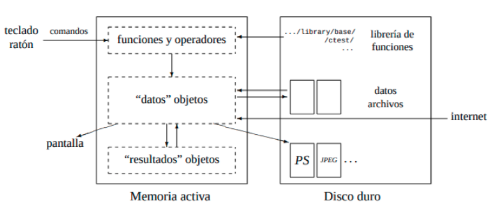

# TODOS LO ODIAN O TODOS LO AMAN

---

## Historia
* R es un lenguaje de programación creado por los estadísticos Ross Ihaka y Robert Gentleman en 1996. 

---
## ¿Porqué usamos R?

* R, es software libre,gratuito

* La sintaxis de R es muy simple e intuitiva

* **CÓDIGO ABIERTO** Licencia GNU:Libertad del uso, modificación y distribución del software.

* R se utiliza para el análisis de datos cuantitativos y cualitativos en diferentes disciplinas.

* Permite además desarrollo de software especializado, por ello, la gran diversidad de paquetes.

---
## ------------------ COMUNIDAD DE R------------------ ##
## R-Community: https://r-community.org/usergroups/
## CDBS: https://comunidadbioinfo.github.io/es/ 


---
## RLadiesGlobal: https://www.rladies.org/
## RLadiesMéxico: https://rladiesmx.netlify.app/


---
## R Base y Paquetes
**R base**  
* Las funciones disponibles viven en el R HOME es el directorio donde R esta instalado. * **R Base** contiene las funciones básicas del lenguaje para leer y manipular datos, algunas funciones gráficas y algunas funciones estadísticas (regresión lineal y análisis de varianza).  

**CRAN**: **Comprehensive R Archive Network (CRAN)**
* Los archivos necesarios para instalar R, código fuente, las instrucciones de instalación, etc
* Actualmente hay ~20,000 paquetes depositados en el CRAN, otros en BioConductor y GitHub.


**Biocondutor**
Se enfoca al desarrollo y distribución de paquetes de R destinados al anáiisis de datos genómicos, incluyendo herramientas para manipular datos de microarreglos, NGS, single cell genomics, etc. 

---

## ¿Cómo funciona R?  

* R es un lenguaje Orientado a Objetos.  
* R guarda los resultados como un “objeto”, de tal manera que se puede hacer un analisis sin necesidad de mostrar su resultado inmediatamente
* Las variables, datos, funciones, resultados, se guardan en la memoria activa del computador en forma de objetos. 
* El usuario puede modificar o manipular estos objetos con operadores y funciones.
* Todas las acciones en R se realizan con objetos que son guardados en la memoria activa del ordenador, sin usar archivos temporales.

{width='80%'height=80%} 

---
## R y Rstudio 
**R** es el lenguaje de programación 
- Descargar [R](https://cran.r-project.org/). 

- Descargar [RStudio](https://posit.co/download/rstudio-desktop/).   

RStudio Desktop es una aplicación de desarrollo de RStudio Inc. Esta app funciona como un entorno de desarrollo integrado (IDE), proporcionando a los usuarios herramientas optimizadas para el lenguaje de programación R. Permite construir scripts, compilar códigos, crear gráficos e incluso trabajar con varios conjuntos de datos en un entorno altamente capacitado.
## Generación de Proyectos para Desarrollo de Software
La versión de escritorio de RStudio permite optimizar el espacio de trabajo almacenando y organizando los datos en proyectos. Además, ofrece una consola y un editor completos que son limpios y fáciles de navegar 

---
## Interfaz de R Studio

{width='100%'height=70%} 

---
# 1. PRIMEROS PASOS E R: CREACIÓN Y MANIPULACIÓN DE OBJETOS
---
**Asignar objetos**: Para crear nuevos objetos se denotado con el símbolo “->” o “<-”, incluso con "=".

```{r}
a<-20
20 -> a
a=20

```

---

* Almacenar variables en un objeto:
```{r}
f1 <- "manzana"
f2 <- "pera"
```

---
## R cómo calculadora 
* Operaciones simples
```{r}
8+9 #sumas
1000-84 #restas
200/9 #división
5*10 #multiplicación
10^2 #exponenciales

```
---
* Operaciones con objetos
```{r}
a=10
b=50
c=2

(a+b)^c

```

---
**Enlistar los objetos en el entorno**
```{r}
ls()
objects()
```

**Borrar objetos**
```{r}
#rm(a)
ls()
```

**Los comentarios en R**
```{r}
# Esto en un comentario

```

---

**Funciones para operaciones numéricas:**
```{r}
# Consultar el manual de ayuda en R de las funciones
  
?ls()
?sum()
?sqrt()
?mean()
?median()
```

# TO/DO: 
1.Crea 5 objetos numéricos de 3 dígitos  
2.Obten el promedio, meadina y la cuadrática de los objetos que creaste  
3.Guarda el resultado de cada operación en un objeto  
---

## Concatenar elementos

```{r}
#Crear un objeto que almacene el nombre de los estudiantes de un grupo
estudiantes <- c("Jose", "Pepe", "Mariana", "Daniel", "Oscar", "Paola")
print(estudiantes)
#Crear un objeto que almacene la edad de cada estudiante
edades <- c("10", "10", "9", "8", "9", "11")
print(edades)
#Crear un objeto con la estatura de los estudiantes
alturas <- c(119, 118, 110, 116, 111, 120)
print(alturas)
alturas/2
```


---
## Crear una tabla con la información

```{r}
cbind(estudiantes,edades, alturas) #concatenamos los objetos por columnas
grupoA <- cbind(estudiantes,edades, alturas) # asignamos la salida de la función cbind, a un nuevo objeto
print(grupoA)
dim(grupoA) #dim() nos permite conocer las dimensiones de un objeto
```

---
## Extraer información de una tabla
#### SINTAXIS: objeto[reglon, columna]
```{r}
print(grupoA)
grupoA[6,] #obtener la fila de la posición 6, correspondiente a la información de Paola
grupoA[,3] #obtener la columna de alturas de de todos los estudiantes
grupoA[6] #obtener el nombre del estudiante Paola
```
---

```{r}
print(grupoA)
grupoA[6,3] #obtener la estatura de Paola 
```

# TO/DO: Obten la edad de Mariana

---
# 2. ESTRUCTURAS DE DATOS EN R
---

## Tipos de objetos en R (vectores)
Los tipos de objetos sobre los que opera **R** son:  
**Objetos simples**
- numeric: números reales o decimales
- integer: números enteros
- complex: números complejos
- character: carácteres
- factor: registrar datos cualitativos.
- logical: resultados lógicos (TRUE o FALSE)

Los objetos pueden combinarse para crear otros nuevos.  
Los objetos pueden tener otros objetos que los conforman, y adquirir una clase diferente:  
**Objetos compuestos**      
 - Listas
 - Data frames
 - Matrices
 - Arreglos
---
Para conocer la clase de cada objeto podemos emplear la función class() , por ejemplo
```{r}
class(a)
class(f1)
```
---
## Objetos simples
---
## Numéricos
```{r}
precios <- c(20,50,100)
class(precios)
```

## Caracteres
```{r}
nombres <- c("Jose", "Pepe", "Mariana", "Daniel", "Oscar", "Paola")
class(nombres)
```

## Factor
```{r}
sexo <- factor(c("Femenino", "Masculino"))
class(sexo)
levels(sexo)

sexo <- c("Femenino", "Masculino")
class(sexo)
levels(sexo)

```

---
## Lógicos
```{r}
 x <- 1
 y <- 2   
 respuesta <- (x > y)      # ¿x es mayor que y?; guardar el resultado en el objeto r
 respuesta            # imprimir el resultado

class(respuesta)       # clase del objeto respuesta

```

---
## Objetos compuestos
---
## LISTAS
* Una lista es una colección ordenada de objetos
* Los componentes pueden ser de diferente tamaño y clase.
* Las listas pueden contener vectores, matrices, cadenas de caracteres, data
frames, funciones, etc.

```{r}
Colecta <- list(especie = "Piper nigrum", muestras= 200,
sitio = c("Bosque Mesófilo", "Bosque Tropical","Selva") )
Colecta
class(Colecta)
```
---
## Extraer información de una lista
#### SINTAXIS: lista$
---
## MATRICES
* Una matriz es una estructura rectangular, que contiene datos de un solo tipo.
* Son usadas principalmente en operaciones matemáticas y estadística.
* Para crear una matriz usaremos la función **matrix()**.
* Si usamos esta función sin proporcionar el número de renglones o columnas que
deseamos crear, por defecto hará el acomodo de los datos en una sola columna.

```{r include=T}
matrix(1:15)
```
---

Si especificamos el número de renglones que deseamos en la matriz, el arreglo
será diferente.

```{r}
matrix(1:15, nrow = 3)
```

Notemos que los datos comienzan a llenar las columnas de arriba a abajo y de 
izquierda a derecha.
---

Si le indicamos un número de columnas y renglones menor al número de datos, 
se usarán los que cubran los espacios en la matriz y el resto se descartará

```{r}
matrix(1:15, nrow = 3, ncol = 3)
```

---
Por otro lado, si le indicamos un número de columnas y renglones que sobrepasa
el número de datos disponibles, los datos se reciclan.

```{r}
matrix(1:15, nrow = 4, ncol = 4)
```
---
# TO/DO: 
* Crea una matriz con  50 números.  
* Identifica las diferencias obtenidas en cada uno de los siguientes casos:  
 a) Con 5 columnas y 10 renglones.  
 b) Con 10 columnas y 10 renglones  
 c) Con sólo 2 columnas   
---

## ARRAY
* Un array es una extensión de un vector a más de dos dimensiones.  
* Los arrays se emplean para representar datos multidimensinales de un único tipo.  
* Los arrays son raramente utilizados en el análisis de datos, por este motivo no profundizaremos en su estudio en este texto.
### SINTAXIS: array(datos, dimensiones)

```{r}
miarray <- array(data=letters[1:24], dim=c(3, 4, 2))

#Si queremos extraer la letra almacenada en la fila 1 y columna 3 de la segunda capa de miarray usamos el siguiente código:
miarray[1, 3, 2]

```

---

```{r}

#Si queremos extraer la segunda capa completa usamos el siguiente código.
miarray[,, 2]

```

# TO/DO: Extrae la letra "k"

---
## DATA FRAME
* Es una lista de vectores de la misma longitud en una estructura
rectangular, que R representa de forma similar a una tabla.
* Estructuras de datos de dos dimensiones (rectangulares) que pueden contener datos de diferentes tipos (cualitativos/cuantitativos).
* Debe contener el mismo número de elementos por cada objeto

```{r}
df <- data.frame(
  "id" = 1:4, 
  "profesion" = c("musico", "pintor", "enfermedo", "actor"), 
  "edad" = c(20, 30, 18, 32),
  "nombre" = as.character(c("Ana", "Pepe", "Maria", "Arturo"))
)

df

```

---
# 3. Funciones para explorar data frame
---

Vamos a usar como ejemplo una base de datos pre-cargada en R base.

```{r}
data() #Explorar las opciones de las bases de datos precargadas en R base
data(PlantGrowth) #Seleccionar la base de datos "PlantGrowth": Results from an Experiment on Plant Growth
#-----------

str(PlantGrowth) #obtener el tipo de objeto/vector de PlantGrowth
dim(PlantGrowth) #obtener las dimensiones del objetos PlantGrowth
names(PlantGrowth) #debido a qué es un data frame (compuesto de columnas y renglones), queremos conocer el nombre de las etiquetas de cada columna
#----------
```
---
# Acceder a los elementos, o columnas del data frame

```{r}
# PlantGrowth$
PlantGrowth$weight
PlantGrowth$group
?attach() # Permite acceder a los objetos en la base de datos simplemente dando sus nombres.
attach(PlantGrowth) 
```
---

```{r}
weight
group
```


```{r}
ncol(PlantGrowth) #obtener el numero de columnas del data frame
nrow(PlantGrowth) #obtener el numero de renglones del data frame

```

---
```{r}
#explorar las categorias o los diferentes niveles de los grupos de tratamientos en el experimento
levels(group)

#Contar el número de categorías que resultan de la función anterior:
#Funciones aninadas
length(levels(group)) #¿cuántos tratamientos se realizaron en el experimento?

#¿Cuántas plantas se utilizaron por cada tratamieto? 
#Hacer un subset de cada uno de los grupos  de tratamientos en el experimento
?subset()
ctrl <- subset(PlantGrowth, group =="ctrl")
c1 <- nrow(ctrl)
trt1  <- subset(PlantGrowth, group =="trt1")
c2 <- nrow(trt1)
trt2  <- subset(PlantGrowth, group =="trt2")
c3 <-nrow(trt2)
```


---

```{r}
#Guardar el conteo de plantas por cada tratamiento en una tabla:
results <- as.table(cbind(c1,c2,c3))
#Renombrarlas columnas y renglones:
colnames(results) <- c("control", "nitrogeno", "fosforo")
names(results)
row.names(results) <- "No.Plantas"
print(results)
```

---
## Generación de gráficos
ctrl <- subset(PlantGrowth, group =="ctrl")
c1 <- nrow(ctrl)
trt1  <- subset(PlantGrowth, group =="trt1")
c2 <- nrow(trt1)
trt2  <- subset(PlantGrowth, group =="trt2")
c3 <-nrow(trt2)

```{r}
barplot(PlantGrowth$weight) # Gráfico de barras, del peso de las plantas
hist(PlantGrowth$weight) # Histogramas
boxplot(PlantGrowth$weight~PlantGrowth$group) # Boxplot por tratamiento
```

---
#Gráfico de barras, del peso de las plantas por cada tratamiento

```{r}
peso.mean <- as.table(cbind(mean(ctrl$weight),mean(trt1$weight),mean(trt2$weight)))

colnames(peso.mean) <- c("control", "nitrogeno", "fosforo")
peso.mean

barplot(peso.mean, main = "Promedio de Crecimiento", ylab = "Peso(gr.)", xlab = "Tratamientos")

```

---
# Exportar figuras
```{r}
#png("PlantGrowth.png")
barplot(peso.mean, beside= T, main = "Promedio de Crecimiento", ylab = "Peso(gr.)", xlab = "Tratamientos", col = c(4,26,39))
#dev.off()
```

---
# 4. Cargar bases de datos/leer archivos
---

```{r}

#Conoce tu directorio actual de trabajo, copia la estructura de la dirección y modificala de acuerdo al sitio dónde se encuentren tus archivos.
getwd() 
#Establece tu directorio de trabajo
#Ejemplo: Estoy en escritorio ("/home/anahi/Escritorio/") y quiero moverme al Repositorio del Curso: 
#setwd("/home/anahi/Escritorio/Primeros-Pasos-en-R/") 
```

---
getwd() #conocer la ubicación de tu directorio de trabajo actual, copiar y pegar, para modificar a continuación la carpeta de trabajo.

setwd("/home/usuario/Escritorio/Primeros-Pasos-en-R/DataBases/") #establecer la ruta al directorio en que se encuentran los archivos que deseas leer


---

**Archivos .txt**  
Los archivos con extensión .txt pueden ser leídos empleando la función read.table().  
Aunque no son tan comunes para leer en R.


```{r}
arboles <- read.table("DataBases/Arboles.txt", sep = " ", header = T)
head(arboles)
```

---

**Archivos .csv**  
Los archivos con extensión .csv pueden ser leídos empleando la función read.csv().  


```{r}
head(read.csv("DataBases/Poblaciones.csv"))
```
```{r}
head(read.csv("DataBases/Poblaciones.csv", sep = "\t", header = T))
```

---

**Archivos excel**
~~~
Existe un paquete especial para leer archivos de excel:
library(readxl)

Sin embargo es recomendable convertir tus archivos .xlsx a .csv
~~~


---

## Practica
* Este es un Data Paper https://db.cger.nies.go.jp/JaLTER/metacat/metacat/ERDP-2020-01.1/jalter-en 
En Sapporo,Japón en 1979 y 1989, se llevó a cabo un monitoreo sistemático de abejas, en el Jardín Botánico de la Universidad de Hokkaido, el estudio incluía el muestreo de abejas y el registro de las flores visitadas por las abejas de abril a septiembre. 

* Preguntas: 
  1. ¿Qué información se recolectó en el data paper? Explora los encabezados del archivo y describe brevemente.
  1. ¿Cuántos ejemplares de abejas se resgristraron?
  2. ¿Qué géneros de abejas se encontraron en este estudio?
  3. ¿Cuántas flores diferentes visitaron las abejas de este estudio?
  4. ¿Cuántos individuos se registraron por cada año? Enlistalos en una tabla con la función as.table()

---
Codigo
```{r}
polinizadores <- read.csv("DataBases/PolinizadoresJapon.csv", header = T, sep = ",") 
#la opcion "sep" nos permite cambiar el delimitador que tengas nuestro archivo de origen: tabulador "\t" , punto y coma (;), espacios ("\s"). 
names(polinizadores)
familia <- polinizadores$Family #seleccionar la columna Family y guardarlo en un objeto
str(familia)
length(familia)
head(familia)
familia <- as.factor(familia)
```

---
```{r}
Family <- levels(familia)
length(levels(familia))

length(levels(as.factor(polinizadores$Flower)))
length(polinizadores$Flower)

?subset()
(levels(as.factor(polinizadores$Year)))

```

---
```{r}
ind_1979 <- subset(polinizadores, Year==1979) 
head(ind_1979)
ind_1979.no <- length(levels(as.factor(ind_1979$Specimen_id)))
ind_1979.no
```

---
## Referencias:
 
[R para Principiantes](https://cran.r-project.org/doc/contrib/rdebuts_es.pdf).

[R for Data Science](https://r4ds.had.co.nz/)

[Learning R Language](https://riptutorial.com/Download/r-language.pdf)
---
